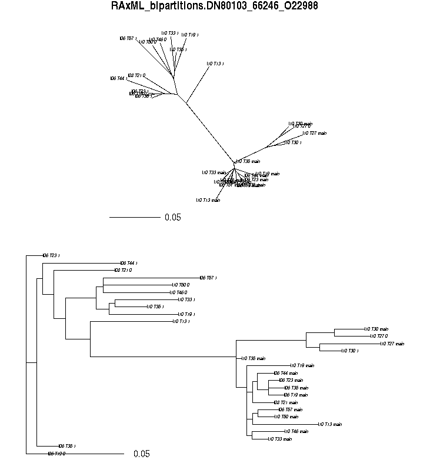

# AFRODYN

Scripts and files for AFRODYN analyses

## 0 PREPARATION

### 0.1 Upload files and folders to cluster

The folder *hybpiper* should be uploaded to your home directory in the cluster and its filepath should be updated in scripts

### 0.2 Rename output files and folders

Nom du job **-N** and **path_to_dir_out** should be changed for each run of the script so you know what is contained in the output folder

```bash
# Nom du job
#$ -N hybpiper_annonaceae
############################################################
```
```bash
path_to_dir_out="/home/helmstetter/output/annonaceae_$JOB_ID/";
```
This must be done for all of the scripts run via qsub

### 0.3 Load modules and install prerequisites

nw_ed:
```bash
module load bioinfo/newick-utils/1.6 
```
http://cegg.unige.ch/newick_utils

ASTRAL:

https://github.com/smirarab/ASTRAL

phyx:
```bash
module load bioinfo/phyx/0.999 
```
https://github.com/FePhyFoFum/phyx

## 1 RUN HYBPIPER

Read through the *hybpiper.sh* script before the next steps to ensure you understand the requirements

### 1.1 Edit filepaths of input fastqs

Make sure these paths are correct on your machine:

```bash
#Files that are in $path_to_dir_in:
#Reference file e.g. Annonaceae_nuc_exons.fa
#namelist.txt (section 1.3)
#namelist contains the sample names that will be analysed
path_to_dir_in="/home/helmstetter/afrodyn/hybpiper/data";

#this is where the hybpiper folder is located after download
#https://github.com/mossmatters/HybPiper
path_to_hybpiper="/home/helmstetter/afrodyn/hybpiper/program";

#The 'scripts' folder contains scripts for running intronerate
#and generating summary stats:
#hybpiper_stats.sh OR hybpiper_stats_palm.sh if working with palms 
#intronerate.sh
#get_seq_lengths.sh
path_to_scripts="/home/helmstetter/afrodyn/hybpiper/scripts";

#output folder
path_to_dir_out="/home/helmstetter/output/$JOB_ID/";

#temporary folder (intermediate files)
path_to_tmp="/scratch/helmstetter_$JOB_ID";
```

Replace this seciton with the full filepaths of your input fastqs:

```bash
############################
# INSERT PATHS TO RAW FASTQs 
############################

scp nas2:/data/projects/afrodyn/RUN62_HISEQ/paired/INDEX12/* $path_to_tmp
scp nas2:/data/projects/afrodyn/RUN52/paired/trimtfiltcutR52-TAG-71* $path_to_tmp
scp nas2:/data/projects/afrodyn/RUN60_HISEQ/paired/trimtfiltcutRUN60_HISEQ-INDEX02-TAG-62* $path_to_tmp
```

### 1.2 Edit renaming of input fastqs

Input fastq files need to be renamed to the pattern I01_T59_R1.fastq.gz. I01 is the index or run name, T59 is the individual tag and R1 specifies read one or read two. 

Renaming should be modified to get rid of the prefixes in your fastq filenames. An example is below

```bash
echo "renaming files"

#Start with:
#trimtfiltcutRUN60_HISEQ-INDEX02-TAG-62_R2_paired.fastq.gz

rename -v 'trimtfiltcutRUN60_HISEQ-INDEX' 'I' *
rename -v -- '-TAG-' '_T' *
rename -v '_paired' '' *
echo "done renaming files"

#End with:
#I02_T62_R2.fastq.gz
```

### 1.3 Make namelist, add name to hybpiper.sh and add to data folder

The namelist tells the scripts which individuals you are analysing. This file contains a list of all of the individuals you want in your analysis as follows

```bash
I02_T7
I10_T25
I10_T13
I10_T45
I12_T79
I10_T43
I10_T27
I10_T30
I10_T32
I10_T16
I10_T23
I12_T76
I10_T37
I10_T10
I12_T90
```

Place this file in the **data** folder

I suggest changing the following line of hybpiper.sh so that namelist_GROUPNAME.txt is your own unique name such as namelist_annonaceae.txt

```bash
mv $path_to_tmp/namelist_GROUPNAME.txt $path_to_tmp/namelist.txt
```

### Make and add reference file to data folder

This file contains your reference exons to be input into hybpiper.

Reference headers must have a hyphen between Species-Exon as follows:

```bash
>Monodora-DN32919_25266_Q05728
ATGAATACAATGGAGCTCTTCCATGGCATTGCTGCTGC
>Monodora-DN32989_25502_Q8GWB4
ATGTATCACTCAAGTTTTGTTAATGAAGAAGGCATTGC
>Monodora-DN33057_25972_Q93ZW3
ATGAGTGCGGAGCCCTTTTACAAGTTGGTGAAACTTGT
```

Place this file in the **data** folder

The reference must be placed in the hybpiper.sh script as well. Open up hybpiper.sh with a text editor and find & replace "Annonaceae_nuc_exons.fa" with the name of your reference file.

### 1.4 Edit hybpiper_stats.sh

This script must be edited to include the correct reference file so that stats files can be created

### 1.5 Run hybpiper.sh

This script will produce stats files for the run and four folders containing exons, introns, supercontigs and one folder with the results of the paralog checks.

### 1.6 Sort hybpiper output

Go into your *retrieved_supercontigs* folder and run post_hybpiper.sh to modify headers and remove linebreaks to facilitate alignment

### 1.7 75_75 loci

Download the *test_seq_lengths.txt* file from your output folder and run 75_75.R using this file

## 2 IDENTIFY AND REMOVE PARALOGS

### 2.0 PALMS ONLY

For some reason, hybpiper detects no paralogs when using the palm reference where exons have been merged into genes. Hybpiper will need to be rerun with the reference where the exons are split (palms.exons_split.final.fasta). Remember to change the name of the reference in hybpiper.sh and hybpiper_stats.sh

After which, step 2 can be run as normal using the hybpiper output from the second run, where exons are split.

### 2.1 Run paralogs.sh

Change the relevant filepaths to correspond to your hybpiper run, and run paralogs.sh, using 8 cores.

### 2.2 Examine and identify paralogous loci

After running paralogs.sh you must locate the treefiles for assessment

```bash
mkdir trees

find . -name '*bipartitions.*' -exec cp -t trees {} +
```

Download trees folder to your computer

Use R script plot_paralogs.R to plot trees and examine by eye. You are looking for trees where 'main' sequences are clustered, separate from alternative '.0' or '.1' sequences.

Here is an example of a tree suggestive of paralogy



Here is an example of an incorrect flag by hybpipers paralog detection algorithm


Make a list of the names of exons that show paralogy as follows

```bash
DN11525_9850_Q9M9Q2
DN16442_21804_Q9FPS0
DN17392_3647_Q84TI9
DN37672_70315_Q9FMU5
DN45547_52510_Q9S7X8
DN46758_53315_Q8GYI7
DN48456_94114_Q9SUV4
DN54538_77622_Q85B45

```
### 2.2.1 PALMS ONLY

Paralogy will be detected on individual exons. In order to assess whether a *gene* is paralogous, I suggest you look at the proportion of verified paralogs vs non-paralogs for each gene. If paralog proportion is higher than 50%, treat the gene as a true paralog and remove this locus from the *gene* hybpiper run.

Continue using the *gene* hybpiper run for the remaining steps.

### 2.3 Verifying paralogs haven't been missed

A file called "loci_list.txt" is output by paralogs.sh. This file contains a list of all of the loci that are putatively paralogous. Sometimes lines will end with a filepath or not e.g.

```bash
DN11525_9850_Q9M9Q2 #important that at least one line without paralogs is present
DN11525_9850_Q9M9Q2./I01_T19/genes_with_paralog_warnings.txt/genes_with_paralog_warnings.txt
DN11525_9850_Q9M9Q2./I01_T22/genes_with_paralog_warnings.txt/genes_with_paralog_warnings.txt
DN11525_9850_Q9M9Q2./I01_T26/genes_with_paralog_warnings.txt/genes_with_paralog_warnings.txt
DN11525_9850_Q9M9Q2./I01_T36/genes_with_paralog_warnings.txt/genes_with_paralog_warnings.txt
DN11525_9850_Q9M9Q2./I01_T59/genes_with_paralog_warnings.txt/genes_with_paralog_warnings.txt
DN11525_9850_Q9M9Q2./I02_T28/genes_with_paralog_warnings.txt/genes_with_paralog_warnings.txt
DN11525_9850_Q9M9Q2./I02_T56/genes_with_paralog_warnings.txt/genes_with_paralog_warnings.txt
DN11525_9850_Q9M9Q2./I06_T59/genes_with_paralog_warnings.txt/genes_with_paralog_warnings.txt
DN11525_9850_Q9M9Q2./I10_T15/genes_with_paralog_warnings.txt/genes_with_paralog_warnings.txt
DN11525_9850_Q9M9Q2./I10_T18/genes_with_paralog_warnings.txt/genes_with_paralog_warnings.txt
DN11525_9850_Q9M9Q2./I10_T51/genes_with_paralog_warnings.txt/genes_with_paralog_warnings.txt
DN11525_9850_Q9M9Q2./I10_T59/genes_with_paralog_warnings.txt/genes_with_paralog_warnings.txt
DN11525_9850_Q9M9Q2./I10_T62/genes_with_paralog_warnings.txt/genes_with_paralog_warnings.txt
```
It is important that at least one line with only the name of the locus e.g. the top line in the example above is present.

If not, the script will not be able to locate the locus and therefore not remove the paralog.

If you find a case where there is a file path on each line, have a look at how many times paralogs were detected in that locus. Typically it is less than 4, so you would not have enough information to consider this as a paralog anyway.

This should be the number of times the exon name occurs in "loci_list.txt" but can also be confirmed by looking at the hybpiper log file and how many times the exon is flagged as a paralog. 

Otherwise, the locus can be manually removed/added to the list of paralogs at a later stage.

## 3 SEQUENCE ALIGNMENT

### 3.1 Run align.sh

Take the filepath of your modified *retrieved_supercontigs* folder (path should end in */oneline/header*) and modify the *path_to_dir_in* in align.sh

```bash
path_to_dir_in="/home/helmstetter/hybpiper_fam_1493584/retrieved_supercontigs/oneline/header";
```
Run *align.sh*

### 3.2 Run post_align.sh

Go into the ouput directory from *align.sh* and run *post_align.sh*

This will grab the relevant output files and put them into a new folder *gblocks*

```bash
bash "~/scripts/post_align.sh"

cd gblocks/
```

## 4 INFER GENE TREES AND RUN ASTRAL

### 4.1 Run genetrees.sh

Modify the path_to_dir_in with your *gblocks* output folder from post_align.sh (step 3.2)

For example:

```bash
path_to_dir_in="/home/helmstetter/align_fam_1493810/helmstetter_1493810/gblocks";
```

### 4.2 Collect trees 

After running enter output folder and run 

```bash
mkdir trees

find . -name '*bipartitions.*' -exec mv -t trees {} +

cd trees

#Select only 75_75 loci
mkdir 75_75
```
This will take all of the appropriate output trees (with support labels) and put them into a new folder trees.

We make a 75_75 folder to prepare for the next steps

### 4.3 Choose only those trees for 75_75 loci

Your previously identified 75_75 loci (1.7)

We should now make a file, 75_75.txt, that allows us to select only 75_75 trees for downstream inference

First, make a directory for these files

```bash
mkdir 75_75
```
Your 75_75.txt should look like this for genetrees:

```bash
cp *DN60091_54632_Q94C90_supercontig.FNA* 75_75
cp *DN34701_36663_Q84JA6_supercontig.FNA* 75_75
cp *DN31863_20639_P17745_supercontig.FNA* 75_75
cp *DN53845_77411_Q9ZS97_supercontig.FNA* 75_75
cp *DN68704_26115_O81153_supercontig.FNA* 75_75
cp *DN38045_76398_Q9SYK9_supercontig.FNA* 75_75
cp *DN11560_9935_Q94B42_supercontig.FNA* 75_75
```
Run this file with bash or copy and paste (not if there are many lines as it can skip) while in your 75_75 folder 

### 4.4 Remove paralogous loci

Use your list of paralog loci from 2.2 to **mv** these files to another folder so they are not included in the ASTRAL analyses

```bash
mkdir paralogs

mv *DN11525_9850_Q9M9Q2* paralogs
mv *DN16442_21804_Q9FPS0* paralogs
mv *DN17392_3647_Q84TI9* paralogs
mv *DN37672_70315_Q9FMU5* paralogs
mv *DN45547_52510_Q9S7X8* paralogs
mv *DN46758_53315_Q8GYI7* paralogs
```

### 4.5 Prepare ASTRAL input file

Prepare your file for ASTRAL run by concatenating all 75_75 trees into one file

```bash
cat *.FNA > all.trees
```
Download this file to your computer, preferably into the directory where you installed ASTRAL

### 4.6 Collapse branches with bootstrap < 10

Collapsing very low support branches is thought to improve accuracy of support values

Move into the directory with your ASTRAL input file and run

```bash
module load bioinfo/newick-utils/1.6

nw_ed all.trees 'i & b<=10' o > all_bs10.trees 
```

### 4.7 Run ASTRAL

An ASTRAL run with no option -t will annotate branches with local posterior probability. -t 1 will annotate them with quartet support (hence the QS in filename).

Make sure you run ASTRAL on your collapsed trees file

```bash
java -jar PATH_TO_ASTRAL/astral.5.5.11.jar -t 1 -i all_bs10.trees -o astral_all_bs10_QS.tre 2> astral_all_bs10_QS.log
```

You can look at the log file to find numbers related to quartet support etc

Download and have a look at your output ASTRAL tree using figtree

### 4.8 Annotate tree

Copy your output ASTRAL tree into the *taxon_name_subst* folder

Make a new *sub_table.txt* file. This must contain tab-separated columns with current and new tip names in the format below:

```bash
I10_T53	Desmos_sp
I10_T59	Goniothalamus_borneensis
I10_T54	Friesodielsia_excisa
I10_T55	Popowia_alata
I10_T56	Sageraea_lanceolata
I10_T57	Phaeanthus_splendens
I10_T58	Neouvaria_acuminatissima
```

Once you have made this file run this command to add new names to tree tip labels. Python version 2.7 is needed to run this.

The tree can also be annontated in a similar way in R using the function *sub.taxa.label* from the package *phytools*.

```bash
python2.7 taxon_name_subst.py sub_table.txt astral_fam_1493813_bs10_LR.tre 
```

Be amazed at your taxonomic insights using Figtree

## 5 INFER CONCATENATED RAxML TREE

### 5.1 Select 75_75 loci

We're now going back to the post-alignment stage:

```bash
/home/helmstetter/align_fam_1493810/helmstetter_1493810/gblocks
```
You can use the same 75_75 commands as for the genetrees to copy the alignments to a new folder

```bash
cp *DN60091_54632_Q94C90_supercontig.FNA* 75_75
cp *DN34701_36663_Q84JA6_supercontig.FNA* 75_75
cp *DN31863_20639_P17745_supercontig.FNA* 75_75
cp *DN53845_77411_Q9ZS97_supercontig.FNA* 75_75
cp *DN68704_26115_O81153_supercontig.FNA* 75_75
cp *DN38045_76398_Q9SYK9_supercontig.FNA* 75_75
cp *DN11560_9935_Q94B42_supercontig.FNA* 75_75
```

Once you've made this run to following to select 75_75 loci

```bash
mkdir 75_75

while read file; do cp "$file" 75_75/; done < ~/75_75_concat_list.txt 

cd 75_75
```
### 5.2 Remove paralogs

Like the genetrees, alignments for paralogous loci *must* be removed

Using your identified paralogs list from 2.2, use your same modification to move paralogs to a new folder. Reminder of example below:

```bash
mkdir paralogs

mv *DN11525_9850_Q9M9Q2* paralogs
mv *DN16442_21804_Q9FPS0* paralogs
mv *DN17392_3647_Q84TI9* paralogs
mv *DN37672_70315_Q9FMU5* paralogs
mv *DN45547_52510_Q9S7X8* paralogs
mv *DN46758_53315_Q8GYI7* paralogs
```
### 5.3 Prepare alignments for concatenation

*fill_fasta.sh* script will insert gap sequences where individuals are missing in each alignment to ensure that after concatenation all sequences are the same length.

Ensure that your namelist has a line return on the last line and does not have an empty last line

```bash
cat ~/data/hybpiper/namelist_fam.txt
```

The script requires your namelist as an argument as follows:

```bash
bash ~/scripts/fill_fasta.sh ~/data/hybpiper/namelist_fam.txt
```


### 5.4 Concatenate alignments

For maximum liklihood approaches we need to concatenate our alignments. Run the following in the folder with your filled alignments.

```bash
module load bioinfo/phyx/0.999 

pxcat -s *.FNA -o fam_1493865.fa -p fam_1493865.partitions
```
This will produce two output files, the fasta file and the partitions file, which are used as input.

Make a new folder in the *data* folder called *raxml* and *cp* these files into it

### 5.5 Infer concatenated RAxML tree

Open and examine the *raxml.sh* script

Change your input folder to wherever your alignment and partitions files are

Names of analysis, fasta and paritions file ( -q -s and -n options) must be changed in the script, here:

```bash
raxmlHPC-PTHREADS -f a -x 12345 -p 12345 -T 2 -# 100 -m GTRGAMMA -o I06_T55,I06_T54 -O -q ./annickia.partitions -s ./annickia.fa -n annickia
```
Run *raxml.sh*

Once run, the 'bipartitions' file is the one you are looking for in the output.

Download and open in figtree

Now, marvel at the false confidence of concatenation approaches
