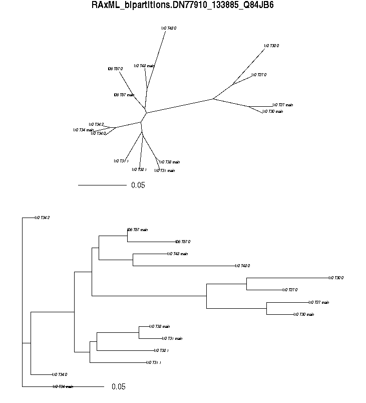

# AFRODYN

Scripts and files for AFRODYN analyses

## 1 hybpiper.sh

### Rename output files and folders

Nom du job **-N** and **path_to_dir_out** should be changed for each run of the script so you know what is contained in the output folder

```bash
# Nom du job
#$ -N hybpiper_annonaceae
############################################################
```

```bash
path_to_dir_out="/home/helmstetter/output/annonaceae_$JOB_ID/";
```

### Edit filepaths of input fastqs

Replace this seciton with the full filepaths of your input fastqs:

```bash
############################
# INSERT PATHS TO RAW FASTQs 
############################

scp nas2:/data/projects/afrodyn/RUN62_HISEQ/paired/INDEX12/* $path_to_tmp
scp nas2:/data/projects/afrodyn/RUN52/paired/trimtfiltcutR52-TAG-71* $path_to_tmp
scp nas2:/data/projects/afrodyn/RUN60_HISEQ/paired/trimtfiltcutRUN60_HISEQ-INDEX02-TAG-62* $path_to_tmp
```

### Edit renaming of input fastqs

Input fastq files need to be renamed to the pattern I01_T59_R1.fastq.gz. I01 is the index or run name, T59 is the individual tag and R1 specifies read one or read two. 

Renaming should be modified to get rid of the prefixes in your fastq filenames. An example is below

```bash
echo "renaming files"

#Start with:
#trimtfiltcutRUN60_HISEQ-INDEX02-TAG-62_R2_paired.fastq.gz

rename -v 'trimtfiltcutRUN60_HISEQ-INDEX' 'I' *
rename -v -- '-TAG-' '_T' *
rename -v '_paired' '' *
echo "done renaming files"

#End with:
#I02_T62_R2.fastq.gz
```

### Make namelist, add name to hybpiper.sh and add to data folder

The namelist tells the scripts which individuals you are analysing. This file contains a list of all of the individuals you want in your analysis as follows

```bash
I02_T7
I10_T25
I10_T13
I10_T45
I12_T79
I10_T43
I10_T27
I10_T30
I10_T32
I10_T16
I10_T23
I12_T76
I10_T37
I10_T10
I12_T90
```

Place this file in the **data** folder

I suggest changing the following line of hybpiper.sh so that namelist_GROUPNAME.txt is your own unique name such as namelist_annonaceae.txt

```bash
mv $path_to_tmp/namelist_GROUPNAME.txt $path_to_tmp/namelist.txt
```

### Make and add reference file to data folder

This file contains your reference exons to be input into hybpiper.

Reference headers must have a hyphen between Species-Exon as follows:

```bash
>Monodora-DN32919_25266_Q05728
ATGAATACAATGGAGCTCTTCCATGGCATTGCTGCTGC
>Monodora-DN32989_25502_Q8GWB4
ATGTATCACTCAAGTTTTGTTAATGAAGAAGGCATTGC
>Monodora-DN33057_25972_Q93ZW3
ATGAGTGCGGAGCCCTTTTACAAGTTGGTGAAACTTGT
```

Place this file in the **data** folder

The reference must be placed in the hybpiper.sh script as well. Open up hybpiper.sh with a text editor and find & replace "Annonaceae_nuc_exons.fa" with the name of your reference file.

### Run hybpiper.sh

This script will produce stats files for the run and four folders containing exons, introns, supercontigs and one folder with the results of the paralog checks.

### post_hybpiper.sh

### 75_75 loci

## 2 paralogs.sh

After running paralogs.sh you must locate the treefiles for assessment

```bash
mkdir trees

find . -name '*bipartitions.*' -exec mv -t trees {} +
```

Download trees folder to your computer

Use R script plot_paralogs.R to plot trees and examine by eye. You are looking for trees where 'main' sequences are clustered, separate from alternative '.0' or '.1' sequences.

Here is an example of a tree suggestive of paralogy


Here is an example of an incorrect flag by hybpipers paralog detection algorithm



Make a list of the names of exons that show paralogy as follows

```bash
DN11525_9850_Q9M9Q2
DN16442_21804_Q9FPS0
DN17392_3647_Q84TI9
DN37672_70315_Q9FMU5
DN45547_52510_Q9S7X8
DN46758_53315_Q8GYI7
DN48456_94114_Q9SUV4
DN54538_77622_Q85B45
```

## 3 align.sh

### post_align.sh

## 4 genetrees.sh

After running enter output folder and run 

```bash
mkdir trees

find . -name '*bipartitions.*' -exec mv -t trees {} +

#Select only 75_75 loci
mkdir 75_75
```
### 75_75.txt

Your 75_75_list.txt file should be placed in your home directory and look like this for genetrees:

```bash
RAxML_bipartitions.aligned.header.DN80049_144250_Q8GX43_supercontig.FNA
RAxML_bipartitions.aligned.header.DN79500_139662_Q94AG3_supercontig.FNA
RAxML_bipartitions.aligned.header.DN32551_23546_O80541_supercontig.FNA
RAxML_bipartitions.aligned.header.DN19702_40117_Q9LN60_supercontig.FNA
RAxML_bipartitions.aligned.header.DN78604_58111_O65525_supercontig.FNA
RAxML_bipartitions.aligned.header.DN74895_124004_Q8S8M1_supercontig.FNA
```

Run this line while in your 75_75 folder 

```bash
while read file; do mv "$file" 75_75/; done < ~/75_75_list.txt 
```

Use your list of paralog loci to transfer them to another folder

```bash
mkdir paralogs

mv *DN11525_9850_Q9M9Q2* paralogs
mv *DN16442_21804_Q9FPS0* paralogs
mv *DN17392_3647_Q84TI9* paralogs
mv *DN37672_70315_Q9FMU5* paralogs
mv *DN45547_52510_Q9S7X8* paralogs
mv *DN46758_53315_Q8GYI7* paralogs
```

Prepare your file for ASTRAL run by concatenating all trees into one file

```bash
cat *.FNA > all.trees
```
Download this file to your computer

collapse branches with bootstrap < 10

### Install nw_ed and ASTRAL

```bash
nw_ed all.trees 'i & b<=10' o > all_bs10.trees 
```

Run ASTRAL

An ASTRAL run with no option -t will annotate branches with local posterior probability. -t 1 will annotate them with quartet support (hence the QS in filename).

```bash
java -jar astral.5.5.11.jar -t 1 -i all_bs10.trees -o astral_all_bs10_QS.tre 2> astral_all_bs10_QS.log
```

The sub_table.txt file contains tab-separated columns with old and new names as follows:

```bash
I10_T53	Desmos_sp
I10_T59	Goniothalamus_borneensis
I10_T54	Friesodielsia_excisa
I10_T55	Popowia_alata
I10_T56	Sageraea_lanceolata
I10_T57	Phaeanthus_splendens
I10_T58	Neouvaria_acuminatissima
```
Run this command to add new names to tree tip labels

```bash
python2.7 taxon_name_subst.py sub_table.txt astral_fam_1493813_bs10_LR.tre 
```


## 5 concat.sh

### fill_fasta.sh